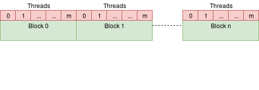
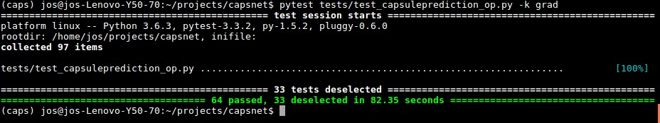

Recently I've spent some time on CUDA programming and implementing custom Ops for TensorFlow. As an exercise, I decided to take a shot at implementing a custom Op for one of the operations in capsule networks that would normally require some reshape hacking or at least a [couple of intermediate TensorFlow Ops](https://github.com/Sarasra/models/tree/master/research/capsules). If you're not familiar with Capsule Networks, have a look at the [original paper](https://arxiv.org/abs/1710.09829) or my previous post. The open-sourced capsule network code by the paper's authors can be found [in this repo](https://github.com/Sarasra/models/tree/master/research/capsules). The code that we discuss in this blog post can be found in [one of my own repos](https://github.com/jostosh/capsnet).

Many of the concepts that are covered in this post (CUDA, TensorFlow custom Ops, gradient testing) can be learned by going through their corresponding documentations, but I always think it is enlightening to see how such separate elements come together. This is the main motivation behind my blog post: showcasing the development of a custom TensorFlow Op with CUDA from start to end. So let's commence.

There also exists a Chinese translation of this post by [Jakukyo Friel](https://www.jqr.com/article/000055).

## Capsule Prediction
The operation of interest in this blog post is the one that computes:

$$
\hat{\boldsymbol u}_{j|i} = W_{ij} \boldsymbol u_{ij}
$$

where $\boldsymbol u_{ij}$ is the activation vector of capsule $j$ as 'predicted' by capsule $i$ through the matrix-vector multiplication 
$W_{ij} \boldsymbol u_i$. The matrix $W_{ij}$ is of shape `[out_dim, in_dim]` and the vector $\boldsymbol u_i$ denotes the output vector of capsule $i$. A single capsule layer computes this for all pairs $i,j$ and for all samples in a batch. Hence, the tensors `W_ij` and `u_i` are actually of shape `[batch_size, in_caps, in_dim]` and `[in_caps, out_caps, out_dim, in_dim]` respectively. This means that we will build an op that just takes in these two tensors and computes an output tensor `u_hat_ji` of shape `[batch_size, in_caps, out_caps, out_dim]`. In other words, for all batch indices `[0,1,...,batch_size-1]` and for all combinations of in capsules `[0,1,...,in_caps-1]` and out capsules `[0,1,...,out_caps-1]` we have to compute a matrix-vector product.

## TensorFlow Kernel Implementation
Our custom Op will be most valuable if we implement it for a GPU. In the [TensorFlow documentation](https://www.tensorflow.org/extend/adding_an_op), you can find the necessary material to get you started on your own C++ kernels for TensorFlow. Then, you can read up on how to empower your algorithms with massively parallel GPU capabilities in [this book](https://developer.nvidia.com/cuda-example) or [online](https://devblogs.nvidia.com/even-easier-introduction-cuda/). I will not repeat the details that you can find there, but I will provide a practical example that hopefully helps to understand how you can use CUDA for your own TensorFlow Ops. For me, getting to know some CUDA was perhaps less difficult than I thought, but squeezing out all performance can be tricky so I will leave further optimization for... not sure if I'll ever do this.

## Op Registration
Let's do the forward pass of the Op. First, we will register the Op:
```cpp
REGISTER_OP("CapsulePrediction")
.Input("input: T")
.Input("weights: T")
.Output("output: T")
.Attr("T: type")
.SetShapeFn([](InferenceContext* ctx) {
    // Get shapes and ensure correct dimensionality
    ShapeHandle in_shape;
    ShapeHandle weights_shape;
    TF_RETURN_IF_ERROR(ctx->WithRank(ctx->input(0), 3, &in_shape));
    TF_RETURN_IF_ERROR(ctx->WithRank(ctx->input(1), 4, &weights_shape));

    // Construct and set the output shape
    DimensionHandle out_d0, out_d1, out_d2, out_d3;
    std::vector<DimensionHandle> out_dims;
    out_dims.push_back(ctx->MakeDim(ctx->Dim(ctx->input(0), 0)));
    out_dims.push_back(ctx->MakeDim(ctx->Dim(ctx->input(1), 0)));
    out_dims.push_back(ctx->MakeDim(ctx->Dim(ctx->input(1), 1)));
    out_dims.push_back(ctx->MakeDim(ctx->Dim(ctx->input(1), 2)));
    ShapeHandle out_shape = ctx->MakeShape(out_dims);
    ctx->set_output(0, out_shape);

    return Status::OK();
});
```

For now, I have defined this so that we could later specify different TensorFlow kernels for different dtypes by adding the `"..: T"` specification. Some of the classes that you see here such as `ShapeHandle`, `DimensionHandle` and `InferenceContext` are defined in the `tensorflow` namespace. The code shows a _shape function_ that is implemented as a lambda function which first ensures `ctx->input(0)` (the input $\boldsymbol u_i$) and `ctx->input(1)` (the weights $W_{ij}$) have the correct rank. Then, we determine the dimensions of the output tensor which we can obtain from the input tensors. The dimension of the Op's output is `[batch_size, in_caps, out_caps, out_dim]`, so we take `batch_size` and `in_caps` from the $\boldsymbol u_i$ tensor and `out_caps` and `out_dim` from the $W_{ij}$ tensor.

## Forward Capsule Prediction
Now, let's look at the Op's kernel. The word 'kernel' is TensorFlow terminology for the device-specific implementation of an Op. When defining a custom kernel, it should inherit from TensorFlow's `OpKernel` and it shall implement the `Compute` method:
```cpp
class CapsulePredictionOp : public OpKernel
{
 public:
  explicit CapsulePredictionOp(OpKernelConstruction* ctx) : OpKernel(ctx) { }

  void Compute(OpKernelContext* ctx) override
  {
    // Get inputs
    const Tensor& input = ctx->input(0);
    const Tensor& weights = ctx->input(1);

    // Setup output shape
    const TensorShape& input_shape(input.shape());
    TensorShape output_shape(weights.shape());
    output_shape.InsertDim(0, input_shape.dim_size(0));
    output_shape.RemoveDim(4);

    // Allocate output tensor
    Tensor* output = nullptr;
    OP_REQUIRES_OK(ctx, ctx->allocate_output(0, output_shape, &output));

    // Get the Eigen tensors and pass them on the launcher
    auto input_tensor   = input.tensor<float, 3>();
    auto weights_tensor = weights.tensor<float, 4>();
    auto output_tensor  = output->tensor<float, 4>();
    launchCapsulePrediction(ctx->eigen_device(), input_tensor, weights_tensor,
      output_tensor);
  }
};
```
In the implementation above we haven't done anything with CUDA yet, but we'll get there so don't worry. The code merely initializes the output shape from the input shapes and allocates the memory. The `OpKernelContext` object that is provided as a parameter makes sure to allocate the memory on the currently used device. In our case, this will be the GPU. Then, we obtain the `Eigen` tensors through the `tensor` method and pass them on to our `launchCapsulePrediction` function, where the actual magic happens.

## Launching the kernel
Our `launchCapsulePrediction` function literally (at least in CUDA terminology) launches code on the GPU. Perhaps a little confusing, but CUDA refers to functions that run code on the 'device' as _kernels_. In TensorFlow terminology, a kernel is not necessarily a GPU implementation, while in CUDA terminology it is. Let's not get too wrapped up in terminology and just get to the code:

```cpp
void launchCapsulePrediction(
  const GPUDevice& d,
  typename TTypes<float, 3>::ConstTensor x,
  typename TTypes<float, 4>::ConstTensor weights,
  typename TTypes<float, 4>::Tensor out)
{
  // Get the dimensions
  const int64 batch_size  = x.dimension(0);
  const int64 in_caps     = x.dimension(1);
  const int64 in_dim      = x.dimension(2);
  const int64 out_dim     = weights.dimension(2);
  const int64 out_caps    = weights.dimension(1);

  // Size first dim
  const int64 w_d0 = out_caps * out_dim * in_dim;
  const int64 x_d0 = in_caps * in_dim;
  const int64 o_d0 = in_caps * out_caps * out_dim;

  // Second dim
  const int64 w_d1 = out_dim * in_dim;
  const int64 x_d1 = in_dim;
  const int64 o_d1 = out_caps * out_dim;

  // Third dim
  const int64 w_d2 = in_dim;
  const int64 o_d2 = out_dim;

  // Launch CUDA kernel for forward operation
  CudaLaunchConfig config = GetCudaLaunchConfig(out.size(), d);
  capsulePredictionKernel
    <<<config.block_count, config.thread_per_block, 0, d.stream()>>>(
      x.data(), weights.data(), out.data(),
      o_d0, o_d1, o_d2, x_d0, x_d1, w_d0, w_d1, w_d2,
      in_dim, out.size());
}
```
The `TTypes` templates that you can see in the function arguments and the `int64` types are defined in the `tensorflow` namespace. The next part about the dimensions should be pretty self-explanatory. Because we are passing our tensor data as one-dimensional arrays to the actual CUDA kernel, we need to figure out what the memory sizes are for each dimension and each kernel. Note that when I say 'memory sizes', I just refer to the number of floats for each axis and not the byte size. Let's consider the memory sizes of the first axis of each tensor:
```cpp
// Size first dim
const int64 w_d0 = out_caps * out_dim * in_dim;
const int64 x_d0 = in_caps * in_dim;
const int64 o_d0 = in_caps * out_caps * out_dim;
```

Awesome, so we can simply get these using the dimensions we determined already. The code tells us that `w_d0` is just the product of `out_caps`, `out_dim` and `in_dim`. So if we want to jump from one index $W_{i,j,k,l}$ to $W_{i+1,j,k,l}$ we should add `w_d0` to the one-dimensional index. The same goes for index  $j$
 and `w_d1` as you might already expect.

The actual CUDA kernel launch is given at the bottom of the function and repeated here:
```cpp
// Launch CUDA kernel for forward operation
CudaLaunchConfig config = GetCudaLaunchConfig(out.size(), d);
capsulePredictionKernel
<<<config.block_count, config.thread_per_block, 0, d.stream()>>>(
  x.data(), weights.data(), out.data(),
  o_d0, o_d1, o_d2, x_d0, x_d1, w_d0, w_d1, w_d2,
  in_dim, out.size());
```
Both statements involve quite a few new concepts. The first statement uses a `GetCudaLaunchConfig` instance as a way to determine the number of blocks and the number of threads per block. It is provided in the TensorFlow header `tensorflow/core/util/cuda_kernel_helper.h`. You should definitely check out that file in case you are working on your own Op! The capsulePredictionKernel is the function that uses CUDA parallelism on the GPU. It is launched by using the triple-fold delimiters: `<<<config.block_count, config.thread_per_block, 0, d.stream()>>>`. When you launch a kernel, you must specify the number of blocks and threads per block, as is done here. The zero on the third position is not relevant for now and it should most likely be zero if you were to implement your own kernels. The CUDA stream `d.stream()` can be thought of as a pipeline of GPU instructions. Whenever you add your kernel to the stream, the stream will make sure the kernel ends before the next kernel on the stream is called. If you want to do two independent tasks in parallel, you could use two streams and launch one task on each.

## Threads And Blocks
All _blocks_ that are assigned to a call can be run in parallel. If you launch a kernel with `N` blocks, then you could think of it as running `N` separate instances of the kernel function. That's pretty convenient! The `nvcc` compiler will make sure that the kernel function has access to the exact block index so that the specific block-instance of the kernel knows which parts of the incoming arrays it should process. So in essence, a CUDA kernel is a kind of _map_ operation.

A block can contain multiple _threads_ itself. Threads are just an additional layer of parallelism, so they run in parallel. Why another layer of parallelism, you ask? Well, threads can do things that blocks cannot. Threads can share their memory which is typically useful when you want to use the same value of some input array in the same block multiple times. The shared memory access is much faster and it is one of the many ways you can optimize your final CUDA implementation. Here is a schematic illustration of the two parallel layers:


## The CUDA kernel
Now we're ready to look at the CUDA implementation of the forward capsule prediction:

```cpp
__global__ void capsulePredictionKernel(
    const float* in, const float* weights, float* out,
    const int64 o_d0, const int64 o_d1, const int64 o_d2,
    const int64 x_d0, const int64 x_d1,
    const int64 w_d0, const int64 w_d1, const int64 w_d2,
    const int64 in_dim, const int64 output_size)
{
  CUDA_1D_KERNEL_LOOP(i, output_size)
  {
    // So here we have out[b,ci,cj,e]
    const int64 b     = i / o_d0;
    const int64 ci    = (i % o_d0) / o_d1;
    const int64 cj    = (i % o_d1) / o_d2;
    const int64 e_out  = i % o_d2;

    // Then, we can have a look at computing the array indices for in and W
    int64 in_idx = b * x_d0 + ci * x_d1;
    int64 w_idx = ci * w_d0 + cj * w_d1 + e_out * w_d2;

    // Initialize result
    float result = 0.0;
    for (int64 v = 0; v < in_dim; ++v)
      // For both in and weights, the subsequent elements of the forward
      // computation are also subsequent in memory
      result += ldg(in + in_idx++) * ldg(weights + w_idx++);
    // Write result
    out[i] = result;
  }
}
```

The first thing you might notice is the `__global__` qualifier that precedes the function definition. This is what the `nvcc` compiler uses to make the function available globally, meaning that it can be launched from CPU, or 'host' code in CUDA terminology. The function's arguments inherit their names from the `launchCapsulePrediction` function so they should not cause too much confusion. The `CUDA_1D_KERNEL_LOOP` is a macro defined in `tensorflow/core/util/cuda_kernel_helper.h`. It replaces this line of code with:

```cpp
for (int i = blockIdx.x * blockDim.x + threadIdx.x; i < output_size;
     i += blockDim.x * gridDim.x)
```

The CUDA kernel launch together with this TensorFlow macro forces us to think in an abstract yet convenient way: it gives us some index `i` that correspond to the `i`-th element of the output array out. Different block/thread instantiations of this kernel will get their own values for `i`. Now all we have to do is figure out what the indices are of our additional arrays `in` and `weights`. In order to do that, we determine the batch index `b`, the input capsule index `ci`, the output capsule index `cj` and the out capsule element index `e_out`:

```cpp
// So here we have out[b,ci,cj,e]
const int64 b     = i / o_d0;
const int64 ci    = (i % o_d0) / o_d1;
const int64 cj    = (i % o_d1) / o_d2;
const int64 e_out = i % o_d2;
```

Determining these becomes straightforward once we know the number of elements contained in each axis. In fact, we have given the memory sizes as arguments to the function. For the other arrays, we can then convert `b`, `ci`, `cj` and `e_out` to their respective one-dimensional indices:

```cpp
// Then, we can have a look at computing the array indices for in and W
int64 in_idx = b * x_d0 + ci * x_d1;
int64 w_idx  = ci * w_d0 + cj * w_d1 + e_out * w_d2;
```

Again, we use the already provided memory sizes for each of the axes to get our one-dimensional indices. These are the indices for the first input capsule element of (i) input capsule `ci` at batch index `b` and (ii) the weights of the input capsule `ci`, the output capsule `cj` and the output capsule element `e_out`. If you're familiar with Matlab, then perhaps it helps to remind you of the `sub2ind` function that concerns the very same thing.

We assume that the last axis of both `in` and `W` corresponds to the input capsule elements. This means that they are subsequent in memory and it is therefore straightforward to construct the loop that goes over the individual input capsule elements:
```cpp
// Initialize result
float result = 0.0;
for (int64 v = 0; v < in_dim; ++v)
  // For both in and weights, the subsequent elements of the forward
  // computation are also subsequent in memory
  result += ldg(in + in_idx++) * ldg(weights + w_idx++);
// Write result
out[i] = result;
```

The `ldg` function is a [Read-Only Data Cache Load Function](https://stackoverflow.com/questions/26603188/what-is-the-difference-between-ldg-intrinsic-and-a-normal-execution). It just receives a pointer to the actual element to read. Remember that we are computing matrix-vector products, which are just sets of inner products. A potential improvement here is to use shared memory since a single input capsule value is used many times, but we will leave out further optimization for now.

## Testing
I want this post to be an end-to-end showcase of the development of a TensorFlow custom Op for GPU. This includes _testing_ the Op. Here's the forward computation with `numpy`:
```python
import tensorflow as tf
from ops.capsuleprediction import capsule_prediction
import numpy as np
from parameterized import parameterized
import itertools


class CapsulePredictionOpTest(tf.test.TestCase):

    @staticmethod
    def _numpy_capsule_prediction(x, weights):
        """ Generate the output for x and weights with numpy """
        batch_size, in_caps, in_dim = x.shape
        _, out_caps, out_dim, _ = weights.shape

        out_shape = (batch_size, in_caps, out_caps, out_dim)
        out = np.zeros(out_shape)

        for b in range(batch_size):
            for i in range(in_caps):
                for j in range(out_caps):
                    for c in range(out_dim):
                        out[b, i, j, c] = np.dot(x[b, i], weights[i, j, c])
        return out
```

The file `ops/capsuleprediction.py` contains the `capsule_prediction` function that actually loads the Op from the shared library file after being compiled. The function above should be straightforward to interpret: we loop over batch, in capsules, out capsules and out capsule elements and compute a dot product for each combination in the output. We'll use this to verify the forward computation of the Op. Another thing to note is the `tf.test.TestCase` class which we inherit from. It provides some utility functions for testing with TensorFlow.

Now let's look at the test for the forward capsule prediction:
```python
@parameterized.expand([
    (batch_size, in_caps, out_caps, in_dim, out_dim) for
    batch_size, in_caps, out_caps, in_dim, out_dim in
    itertools.product([4, 8], [4, 8], [4, 8], [4, 8], [4, 8])
])
def test_capsule_prediction_op(self, batch_size, in_caps, out_caps, in_dim,
                               out_dim):
    """ Tests the forward capsmatmul op """
    x = np.random.rand(batch_size, in_caps, in_dim)
    weights = np.random.rand(in_caps, out_caps, out_dim, in_dim)

    truth = self._numpy_capsule_prediction(x, weights)
    with self.test_session() as sess:
        x_ph = tf.placeholder(tf.float32, x.shape)
        w_ph = tf.placeholder(tf.float32, weights.shape)

        ret = capsule_prediction(x_ph, w_ph)
        out = sess.run(ret, {x_ph: x, w_ph: weights})
    self.assertAllClose(truth, out)
```
I've used quite a few tricks in here. First, the `parameterized` decorator offers a way to invoke the test with different parameters where each test should succeed on its own and will be considered as a separate test by `pytest`. If it fails, the provided input will also be displayed in the test logs so in my experience, using it really speeds up the debugging if needed. The `parameterized.expand` decorator expects a list of tuples. Each tuple will be unpacked as positional function parameters. We can easily generate many tuples to vary the dimension sizes by using itertools.product which takes the Cartesian product of all of its arguments.

The `x` and `weights` arrays are initialized randomly. The TensorFlow graph that we build is simple: it only holds two placeholders and the `capsule_prediction` Op. The returned value should be the same as that of the `_numpy_capsule_prediction` function. Let's run the tests:

A nice feature of `pytest` is that you can add the `-k` flag to select a specific set of tests. Hooray, all tests passed!

## The backward capsule prediction
Next up is the backward computation. You'll notice that we have visited most of the coming concepts already. We already looked at methods to compute the correct indices for one-dimensional arrays by dimension sizes, we wrote a CUDA kernel, we registered our Op and we set up our tests. Therefore, I will speed things up a bit from here on. The only thing that is in our way is the exact definition of the gradient. It helps to consider a normal dense layer first:

$$
\boldsymbol z = W \boldsymbol x
$$

Given the gradients of a loss function $\mathcal L$ with respect to $\boldsymbol z$ we should be able to get the gradients of $\boldsymbol x$ and $W$:

$$
\frac{d \mathcal L}{ d x_i} = \frac{d\mathcal L}{d \boldsymbol z} \frac{d\boldsymbol z}{d x_i} = \vec{\boldsymbol w}_i \boldsymbol z'
$$

where $\vec{\boldsymbol w}_i$ is the i-th row vector and $\boldsymbol z'$ is the vector holding the local gradients of the output. If this is the result for $i$ then the whole gradient for $\boldsymbol x$ can be computed by:

$$
\frac{d \mathcal L}{d w_{rc}} = x_r z'_c
$$

So the matrix holding the gradients becomes an outer product:

$$ 
\frac{d \mathcal L}{dW} = \boldsymbol x (z')^{\top}
$$

Intuitively, this tells us to just pick the two neurons that are connected between these two layers and multiply the local gradient of the output neuron with the input neuron. This means that we can do the same for the capsule prediction layer. The only difference is the dimensionality of the tensors involved.

## The gradient OpKernel
I won't bother you with the details anymore. Here's the implementation:
```cpp
class CapsulePredictionGradOp : public OpKernel
{
 public:
  explicit CapsulePredictionGradOp(OpKernelConstruction* ctx) : OpKernel(ctx) { }

  void Compute(OpKernelContext* ctx) override
  {
    // Get the input tensors
    const Tensor& grad = ctx->input(0);
    const Tensor& input = ctx->input(1);
    const Tensor& weights = ctx->input(2);

    // Get the shapes so that we can allocate outputs
    const TensorShape& input_shape(input.shape());
    const TensorShape& weights_shape(weights.shape());

    // Allocate outputs
    Tensor* grad_input = nullptr;
    Tensor* grad_weights = nullptr;
    OP_REQUIRES_OK(ctx, ctx->allocate_output(0, input_shape, &grad_input));
    OP_REQUIRES_OK(ctx, ctx->allocate_output(1, weights_shape, &grad_weights));

    // Get the Eigen tensors and pass them on to the launch function
    auto input_tensor         = input.tensor<float, 3>();
    auto weights_tensor       = weights.tensor<float, 4>();
    auto grad_tensor          = grad.tensor<float, 4>();
    auto grad_input_tensor    = grad_input->tensor<float, 3>();
    auto grad_weights_tensor  = grad_weights->tensor<float, 4>();
    launchCapsulePredictionGrad(
      ctx->eigen_device<GPUDevice>(), input_tensor, weights_tensor, grad_tensor,
      grad_input_tensor, grad_weights_tensor
    );
  }
};
```


Nothing truly new here. An important difference is that we now have to allocate two output tensors: one for the weight gradient and one for the input gradient. The shape of a tensor's gradient is identical to the shape of the tensor itself. Thus finding the shape for the allocated tensors is a piece of cake. Let's check out the `launchCapsulePredictionGrad` function:

```cpp
void launchCapsulePredictionGrad(
  const GPUDevice& d,
  typename TTypes<float, 3>::ConstTensor input,
  typename TTypes<float, 4>::ConstTensor weights,
  typename TTypes<float, 4>::ConstTensor grad,
  typename TTypes<float, 3>::Tensor grad_input,
  typename TTypes<float, 4>::Tensor grad_weights)
{
  const int64 batch_size  = input.dimension(0);
  const int64 in_caps     = input.dimension(1);
  const int64 in_dim      = input.dimension(2);
  const int64 out_dim     = weights.dimension(2);
  const int64 out_caps    = weights.dimension(1);

  // Size first dim
  const int64 w_d0 = out_caps * out_dim * in_dim;
  const int64 x_d0 = in_caps * in_dim;
  const int64 o_d0 = in_caps * out_caps * out_dim;

  // Second dim
  const int64 w_d1 = out_dim * in_dim;
  const int64 x_d1 = in_dim;
  const int64 o_d1 = out_caps * out_dim;

  // Third dim
  const int64 w_d2 = in_dim;
  const int64 o_d2 = out_dim;

  // Launch input gradient kernel
  CudaLaunchConfig config = GetCudaLaunchConfig(grad_input.size(), d);
  capsulePredictionInputGradKernel
    <<<config.block_count, config.thread_per_block, 0, d.stream()>>>(
      grad.data(), weights.data(), grad_input.data(),
      w_d0, x_d0, x_d1, o_d0, o_d1, out_caps, out_dim, in_dim,
      grad_input.size());

  // Launch weight gradient kernel
  config = GetCudaLaunchConfig(grad_weights.size(), d);
  capsulePredictionWeightsGradKernel
    <<<config.block_count, config.thread_per_block, 0, d.stream()>>>(
      grad.data(), input.data(), grad_weights.data(), batch_size,
      grad_weights.size(), w_d0, w_d1, w_d2, x_d0, x_d1, o_d0, o_d1, o_d2);
}
```

Again, we see a similar code structure. We obtain the dimensions, we determine the memory sizes and finally, we launch not one, but two kernels.

Glad you're still there! Now it gets a bit more complicated. Behold the input gradient CUDA kernel:
```cpp
__global__ void capsulePredictionInputGradKernel(
  const float* grad, const float* weights, float* grad_input,
  const int64 w_d0,
  const int64 x_d0, const int64 x_d1,
  const int64 o_d0, const int64 o_d1,
  const int64 out_caps,
  const int64 out_dim,
  const int64 in_dim,
  const int64 output_size)
{
  CUDA_1D_KERNEL_LOOP(i, output_size)
  {
    // So here we have in_grad[b,ci,e]
    const int64 b     = i / x_d0;
    const int64 ci    = (i % x_d0) / x_d1;
    const int64 e_in  = i % x_d1;

    // Then, we can have a look at computing the array indices for in and W
    int64 w_idx       = ci * w_d0 + e_in;
    int64 grad_idx    = b * o_d0 + ci * o_d1;

    // Initialize result
    float result      = 0.0;
    // Iterate over cj and e_out, we already have the other indices
    for (int cj = 0; cj < out_caps; ++cj)
    {
      for (int e_out = 0; e_out < out_dim; ++e_out)
      {
        // Next element of grad can be found by incrementing grad_idx
        result  += ldg(grad + grad_idx++) * ldg(weights + w_idx);
        // Next element of weights can be found by going to the next output
        // capsule element, meaning that we add in_dim to w_idx
        w_idx   += in_dim;
      }
    }
    // Write the result
    grad_input[i] = result;
  }
}
```

I have added quite some comments to the code to make it more readable. Similar to our previous CUDA kernel, this one determines the axis indices that matter: `b`, `ci` and `e_in`. These are then used to compute the one-dimensional indices for `w` and `grad` (the output gradient). A single input neuron is not just used for one matrix-vector product, but it is involved for all prediction matrices $W_{ij}, j \in \{1, \ldots \# \text{output capsules}\}$. Therefore, we require two loops, one dealing with the output capsules and another one that deals with the individual capsule elements. Rather than just incrementing the index for our weights, we must now skip to the next output capsule in the inner loop. This means that we should add `in_dim` to the index on each iteration.

The weight gradient CUDA kernel implementation is:

```cpp
__global__ void capsulePredictionWeightsGradKernel(
  const float* grad, const float* input, float* grad_weights,
  const int64 batch_size, const int64 output_size,
  const int64 w_d0, const int64 w_d1, const int64 w_d2,
  const int64 x_d0, const int64 x_d1,
  const int64 o_d0, const int64 o_d1, const int64 o_d2
)
{
  CUDA_1D_KERNEL_LOOP(i, output_size)
  {
    // So here we have w[ci,cj,e_out,e_in]
    const int64 ci    = i / w_d0;
    const int64 cj    = (i % w_d0) / w_d1;
    const int64 e_out = (i % w_d1) / w_d2;
    const int64 e_in  = i % w_d2;

    // Then, we can have a look at computing the array indices for
    // in and grad
    int64 input_idx   = ci * x_d1 + e_in;               // (b == 0)
    int64 grad_idx    = ci * o_d1 + cj * o_d2 + e_out;  // (b == 0)

    // Initilize result
    float result      = 0.0;
    // We only iterate over b, since we have the other indices already
    for (int64 b = 0; b < batch_size; b++)
    {
      result += ldg(grad + grad_idx) * ldg(input + input_idx);
      // Next elements can be found by jumping to the next batch
      input_idx += x_d0;
      grad_idx  += o_d0;
    }
    grad_weights[i] = result;
  }
}
```

The same tricks apply here again: we compute the tensor axis indices, we compute the one-dimensional indices and we loop over the required elements to obtain our output. What I didn't mention before is that we have to sum the gradients for each weight over all samples in the batch. Given the memory size for the input and output tensors along the 0-th axis, this is a straightforward thing to do.

Before our gradient implementation nicely integrates with TensorFlow, we have to register it as being the gradient of our `CapsulePrediction` Op:

```python
@ops.RegisterGradient("CapsulePrediction")
def _capsule_prediction_grad(op, grad):
    """ Computes gradient for capsule prediction operation """
    return op_module.capsule_prediction_grad(grad, op.inputs[0], op.inputs[1])
```

Now we can just use tf.gradients after which the computation graph for the gradient should include our gradient op. Awesome!

## Testing The Gradients
We have arrived at one of the last stages: testing the gradient. This really sounds harder than it is. TensorFlow already has a gradient testing utility, and we'll use it here. We add the following methods to our `CapsulePredictionOpTest` class:

```python
@parameterized.expand([
    (batch_size, in_caps, out_caps, in_dim, out_dim) for
    batch_size, in_caps, out_caps, in_dim, out_dim in
    itertools.product([4, 8], [4, 8], [4, 8], [4, 8], [4, 8])
])
def test_capsule_prediction_weights_grad(self, batch_size, in_caps, out_caps,
                                         in_dim, out_dim):
    """ Tests gradient of output w.r.t. weights """
    x = np.random.rand(batch_size, in_caps, in_dim)
    weights = np.random.rand(in_caps, out_caps, out_dim, in_dim)
    out_shape = (batch_size, in_caps, out_caps, out_dim)

    with self.test_session():
        x_ph = tf.placeholder(tf.float32, x.shape)
        w_ph = tf.placeholder(tf.float32, weights.shape)
        fd = {x_ph: x, w_ph: weights}

        caps_out = capsule_prediction(x_ph, w_ph)
        grad_w = tf.test.compute_gradient(
            w_ph, weights.shape, caps_out, out_shape, extra_feed_dict=fd
        )

    self.assertAllClose(grad_w[0], grad_w[1], atol=1e-3, rtol=1e-3)

@parameterized.expand([
    (batch_size, in_caps, out_caps, in_dim, out_dim) for
    batch_size, in_caps, out_caps, in_dim, out_dim in
    itertools.product([4, 8], [4, 8], [4, 8], [4, 8], [4, 8])
])
def test_capsule_prediction_input_grad(self, batch_size, in_caps, out_caps,
                                       in_dim, out_dim):
    """ Tests gradient of output w.r.t. x """
    x = np.random.rand(batch_size, in_caps, in_dim)
    weights = np.random.rand(in_caps, out_caps, out_dim, in_dim)
    out_shape = (batch_size, in_caps, out_caps, out_dim)

    with self.test_session():
        x_ph = tf.placeholder(tf.float32, x.shape)
        w_ph = tf.placeholder(tf.float32, weights.shape)
        fd = {x_ph: x, w_ph: weights}
        caps_out = capsule_prediction(x_ph, w_ph)
        grad_x = tf.test.compute_gradient(
            x_ph, x.shape, caps_out, out_shape, extra_feed_dict=fd
        )

    self.assertAllClose(grad_x[0], grad_x[1], atol=1e-3, rtol=1e-3)
```

The `tf.test.compute_gradient` function determines the 'theoretical' and numerical gradient respectively. The numerical gradient is computed by finite differences whereas the theoretical gradient is computed by our Op's registered gradient. They should be nearly equal, so we assert they are close by using the `assertAllClose` method that is inherited from `tf.test.TestCase`. Here is the resulting output:



In my previous blog post, I have already discussed a capsule network for MNIST classification. We can now insert our `capsule_prediction` function in the code:
```python{24-26}
def digit_caps(incoming, n_digit_caps, dim_digit_caps, name="DigitCaps",
               neuron_axis=-1, capsule_axis=-2, routing_iters=3):
    """ Digit capsule layer """
    with tf.variable_scope(name):
        # Get number of capsules and dimensionality of previous layer
        in_shape = incoming.shape.as_list()
        n_primary_caps = in_shape[capsule_axis]
        dim_primary_caps = in_shape[neuron_axis]
        # Initialize all weight matrices
        w_shape = [n_primary_caps, n_digit_caps, dim_digit_caps, dim_primary_caps]\
            if args.custom_op \
            else [n_primary_caps, n_digit_caps * dim_digit_caps, dim_primary_caps]

        W_ij = tf.get_variable(
            "weights", shape=w_shape,
            initializer=tf.keras.initializers.glorot_uniform()
        )
        # Initialize routing logits, the leading axis with size 1 is added for
        # convenience.
        b_ij = tf.get_variable(
            "logits", shape=[1, n_primary_caps, n_digit_caps],
            initializer=tf.zeros_initializer(), trainable=args.logits_trainable
        )
        if args.custom_op:
            # Custom op
            u_hat = capsule_prediction(incoming, W_ij)
        else:
            # Reshape and transpose hacking
            u_i = tf.transpose(incoming, (1, 2, 0))
            u_hat = tf.matmul(W_ij, u_i)
            u_hat = tf.reshape(
                tf.transpose(u_hat, (2, 0, 1)),
                (-1, n_primary_caps, n_digit_caps, dim_digit_caps)
            )

        def capsule_out(b_ij):
            """ Given the logits b_ij, computes the output of this layer. """
            c_ij = tf.nn.softmax(b_ij, axis=2)
            s_j = tf.reduce_sum(
                tf.reshape(c_ij, (-1, n_primary_caps, n_digit_caps, 1)) * u_hat,
                axis=1
            )
            v_j = squash(s_j)
            return v_j

        def routing_iteration(iter, logits):
            """
            Given a set of logits, computes the new logits using the routing
            definition from the paper.
            """
            v_j = capsule_out(logits)
            a_ij = tf.reduce_sum(tf.expand_dims(v_j, axis=1) * u_hat, axis=3)
            logits = tf.reshape(logits + a_ij, (-1, n_primary_caps, n_digit_caps))
            return [iter + 1, logits]

        # Compute routing
        i = tf.constant(0)
        routing_result = tf.while_loop(
            lambda i, logits: tf.less(i, routing_iters),
            routing_iteration,
            [i, tf.tile(b_ij, tf.stack([tf.shape(incoming)[0], 1, 1]))]
        )
        # Second element of the result contains our final logits
        v_j = capsule_out(routing_result[1])

    return v_j
```

So what about performance? Well, it turns out that training with the custom op runs somewhat slower than training with the transpose and reshape hacking. As I've stated before, the code could be optimized even more. Thanks for staying around till the end and I would love to hear suggestions and feedback!