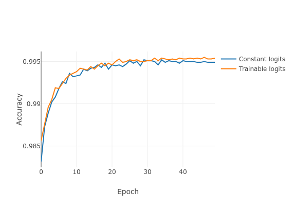

This will hopefully be the first of many posts on various concepts in ML. I love working with on tensor-based models such as neural networks given the vast amount of applications, incredible performance, the room for new ideas and an immense community around it.

## Capsule Networks
In this post I will be looking at an interesting paper that was recently made available [on Arxiv](https://arxiv.org/abs/1710.09829). This paper is co-authored by Geoffrey Hinton, a leading expert in the field of neural networks and deep learning who is currently employed at Google, Toronto. His recent paper on capsule networks has made a serious impression on the community.

It is worth noting that this post assumes prior knowledge of TensorFlow and its most common operators. I should also add that it is really intended as supplementary material. There are quite some concepts and observations that I do not discuss here, but which you can easily acquaint by reading [the article](https://arxiv.org/abs/1710.09829).

## What is a capsule?

Before we get to capsules, we will revisit a few terminological primers for neural networks. Usually, we say that the perceptrons in our neural networks represent features. For example, in image classification with deep convolutional neural networks, the neurons in the last few hidden layers typically represent abstract concepts, such as 'I see two eyes' and the 'the creature has two legs'. This interpretation is of course a bit anthropomorphistic. Nevertheless, it helps to get an intuitive understanding of what neural networks do when they interpret high-dimensional data. The presence of a certain feature in an image is reflected by a nonzero value of the corresponding hidden neuron. Again, with a healthy dose of anthropomorphism, we could say that the greater the neuron's activity, the more `confident' the neuron is of observing the feature.

Hinton and his team rethought the common approach of using perceptrons to build neural networks. Instead, they advocate the use of capsules. A single capsule is just a group of neurons. Just like regular neurons, capsules reside in layers. The numeric properties of neurons such as preactivations and outputs are represented by scalars. In contrast and perhaps not surprisingly, the same properties of capsules are represented by vectors. A single capsule now represents the presence of a feature in an image. In the paper, the word `entity' is used to indicate the same thing as what I refer to as a feature.

In classification, the class of a data instance can be seen as a special kind of entity. In most deep neural networks, class membership is encoded in the output layer as a set of probabilities. This is accomplished by a softmax layer that contains exactly one neuron per output class. In capsule networks, the presence of a class is encoded by a capsule. More specifically, the length of the activity vector of a capsule encodes the degree of confidence towards the presence of the class entity.

This means that capsule networks no longer use a softmax operator to obtain their output distribution. As far as I understand, capsule networks have no explicit notion of class probabilities. They rather encode entities, meaning that multiple entities can be present at the same time, which is exactly the property the authors use to separate the two overlapping digits in section 6 of the paper.

## The Activation Of A Capsule
Capsules have two ways of encoding information: length and direction. To be able to interpret the length of a capsule as a probability, it must be `squashed' so that the length is always between 0 and 1. This is accomplished with a squashing nonlinearity:

$$ 
\boldsymbol v_j = \frac{\| \boldsymbol s_j \|^2}{1 + \| \boldsymbol s_j \|^2} \frac{\boldsymbol s_j}{\| \boldsymbol s_j \|}
$$

which squashes short vectors to near-zero length and long vectors to unit length.

## Multiple Capsule Layers

Apart from the output layer, hidden layers might also be built up out of capsules. These capsules will represent simpler entities than class labels, e.g. pose, deformation, texture etc.

How to go from one capsule layer to another? In regular MLPs, the activation of a whole layer is represented as a vector. In capsule networks, the activation of a single capsule is represented as a vector. While ordinary MLPs can suffice with a single matrix-vector product to compute the preactivation of the next layer $l+1$, capsule layers need such a product for each pair of capsules between the two layers $(\boldsymbol v_j ^{(l)}, \boldsymbol v_j^{(l+1)})$, where $l$ and $l + 1$ are layer indices and $i$ and $j$ are capsule indices.

Following the terminology in the paper, the results of these matrix-vector products are seen as predictions of the output of the capsules in layer $l+1$. The predictions are linearly combined using coupling coefficients to form the current output. Initially, the coupling coefficients are equal and sum to 1. To compute a single forward pass in the network, the coefficients are re-estimated a few times by a process referred to as dynamic routing. This promotes the coupling coefficients between a capsule in $l$ to another in $l+1$ whenever the activity is predicted well. The degree to which these activities agree is determined through an inner product of the actual output and the prediction. As far as I understand, the routing mechanism more-or-less simplifies the interaction between the two layers by inhibiting many matrix-vector products and only promoting a few through a softmax procedure, similar to attention mechanisms as found in machine translation models using RNNs. After a few iterations of dynamic routing, these coupling coefficients converge to a situation where one could regard the higher level entities in $l+1$ to be encoded by only a few lower level entities in layer $l$. To gain a deeper understanding of what's going on, I suggest you have a look at section 2 in the paper.

## Implementation In TensorFlow
Perhaps a new kind of neural network is best explained by looking at a possible implementation. But first, let's have a look at the architecture we need to implement. We will be looking at the MNIST dataset. If you want to skip the explanations here and you just wanna get the code, see the [repository](https://www.github.com/jostosh/capsnet).

### Architecture

We will have to combine 3 layers:

* A regular convolutional layer with ReLU activations, stride 1, $9\times 9$ kernels and 256 filters
* A convolutional capsule layer with activations as described above, stride 2, $9\times 9$ kernels kernels and 32 capsules per spatial output with a dimensionality of 8.
* A fully connected capsule layer with activations as described above, 10 capsules with a dimensionality of 16.

### Inputs And The First Layer
Nowadays, TensorFlow is already shipped with predefined layers, let's save ourselves some time then.

```python
# Define placeholders
x = tf.placeholder(tf.float32, [None, 28, 28, 1])
labels = tf.placeholder(tf.int64, [None])

# Define capsule network
conv1_out = tf.layers.conv2d(x, 256, 9, activation=tf.nn.relu)
pc = primary_caps(conv1_out, kernel_size=9, strides=(2, 2), capsules=32, dim=8)
v_j = digit_caps(pc, n_digit_caps=10, dim_digit_caps=16)
digit_norms = tf.norm(v_j, axis=-1)
```

So we've set up our first convolutional layer and the placeholders that will contain externally provided labels and images.

### Primary Capsule Layer
Good, now the interesting part. The first capsule layer is referred to as the primary capsule layer. It performs a convolution operation followed by the squashing nonlinearity as discussed above. We'll implement the layer as a function. In my implementation, I ended up with the following:
```python
def primary_caps(x, kernel_size, strides, capsules, dim, name="PrimaryCaps"):
    """ Primary capsule layer. Linear convolution with reshaping to account for capsules. """
    preactivation = tf.layers.conv2d(
        x, capsules * dim, kernel_size, strides=strides, activation=tf.identity, name=name,
        kernel_initializer=ConcatInitializer('glorot_uniform', axis=3, splits=capsules)
    )
    _, w, h, _ = preactivation.shape.as_list()
    out = tf.reshape(preactivation, (-1, w * h * capsules, dim))
    return squash(out)
```

Let's break this down. The first statement to compute the preactivation seems obvious, but there is something peculiar going on. Note that we have put `capsules * dim` as the number of filters. This is because each capsule in this layer will have its vector along the depth dimension of the convolutional output volume. The width and height dimensions are only indices for capsules that focus on different parts of the input. Rather than computing `#capsules` convolutions separately, we do everything with a single convolution Op, which is simply more efficient.

The next statement is where we determine the spatial dimensions (the height and the width) of the output volume. The number of capsules in this would then be `h * w * capsules`. We can use this to reshape the output so that the new tensor has a shape of `[batch_size, n_capsules, capsule_dimension]`. We'll create a squashing function that assumes that the capsule elements are indexed on the last axis.

### Squashing Function
Our squashing function is straightforward given the equation from the paper.

```python
def squash(s_j):
    """ Squashing function as given in the paper """
    squared_norms = tf.reduce_sum(tf.square(s_j), axis=-1, keep_dims=True)
    return s_j * squared_norms / (1 + squared_norms) / tf.sqrt(squared_norms + 1e-8)
```

In the first statement, we compute the squared norms along the last axis of the incoming tensor. This works fine with our `primary caps` implementation as shown above, where we have reshaped the tensor so that the capsule's elements are indexed on the last axis. The second statement is a simply a translation from the earlier equation to code. Just to ensure numerical stability in case of small vectors, we add a nonzero constant to the denominator on the right.

### Digit Capsule Layer
Building the next layer is the most difficult part of this reimplementation. In this layer, we have 10 capsules with dimensionality 16, one capsule for each digit. The main difficulty is in the computation of all predicted capsule vectors. In the paper, they express this as follows:

$$
\hat{\boldsymbol u}_{j|i} = \boldsymbol W_{ij} \boldsymbol u_i
$$

where the $i$ index corresponds to the capsules in the primary capsule layer and the $j$ index corresponds to capsules in the digit capsule layer. This means that we need `n_primary_capsules * n_digit_capsules` matrices. It's probably a good idea to have a weight tensor with rank 4, with shape `[n_primary_caps, n_digit_caps, dim_primary_caps, dim_digit_caps]`.

I have spent some time thinking of what might be the most efficient way of computing so many matrix vector products with TensorFlow. TensorFlow's matmul operator is intended for (batched) matrix multiplication. At first sight, our tensors `W_{ij}`and $\boldsymbol u_i$ don't have the right dimensions to do anything like that. However, we can do some reshape hacking that does the trick. Note that the result of a matrix multiplication would be a series of vectors. Each of these vectors would be the predicted activation of a digit capsule. So for a single batch, we would be able to compute the activations of all samples for a single index pair $(i,j)$ by having a matrix with `batch_size` columns and `dim_primary_caps` rows. This would be premultiplied by a matrix with `dim_digit_caps` rows and `dim_primary_caps` columns:

$$
\boldsymbol W_{ij} \left[\begin{array}{cccc} \boldsymbol u^{(1)}_i & \boldsymbol u^{(2)}_i & \cdots & \boldsymbol u^{(n)}_i \end{array}\right]
$$
where the superscripts are the batch indices.

Now it is easy to do the same thing for all $j$ and a single $i$. We can just use a block matrix where the individual matrices for all $j$ are stacked:

$$ 
\left[\begin{array}{c} \boldsymbol W_{i1}\\ \boldsymbol W_{i2} \\ \vdots \\ \boldsymbol W_{im} \end{array}\right] \left[\begin{array}{cccc} \boldsymbol u^{(1)}_i & \boldsymbol u^{(2)}_i & \cdots & \boldsymbol u^{(n)}_i \end{array}\right]
$$

so that the result of the matrix vector product will contain the predicted activations for all $j$, but only a single $i$. I can hear you say it: what to do with the `n_primary_caps` dimension? Well, this dimension is both in the weight tensor, as well as in the primary caps output tensor. This can now be our 'batch' dimension for the matmul operator. This is how the above translates to code:
```python
# Get number of capsules and dimensionality of previous layer
in_shape = incoming.shape.as_list()
n_primary_caps = in_shape[capsule_axis]
dim_primary_caps = in_shape[neuron_axis]
# Initialize all weight matrices
W_ij = tf.get_variable(
    "weights",
    shape=[n_primary_caps, n_digit_caps * dim_digit_caps, dim_primary_caps],
    initializer=glorot_uniform()
)
# Initialize routing logits, the leading axis with size 1 is added for
# convenience.
b_ij = tf.get_variable(
    "logits",
    shape=[1, n_primary_caps, n_digit_caps],
    initializer=tf.zeros_initializer(),
    trainable=args.logits_trainable
)
# Reshape and transpose hacking
u_i = tf.transpose(incoming, (1, 2, 0))
u_hat = tf.matmul(W_ij, u_i)
u_hat = tf.reshape(
    tf.transpose(u_hat, (2, 0, 1)),
    (-1, n_primary_caps, n_digit_caps, dim_digit_caps)
)
```

### Dynamic Routing
Now that we have our $\hat{\boldsymbol u}$ tensor, we can perform dynamic routing. This is simply a matter of translating the pseudo-code in the paper to Python code, so that the `digit_caps` function can be implemented as follows:
```python
def digit_caps(
    incoming, n_digit_caps, dim_digit_caps, name="DigitCaps",
    neuron_axis=-1, capsule_axis=-2, routing_iters=3
):
    """ Digit capsule layer """
    with tf.variable_scope(name):
        # Get number of capsules and dimensionality of previous layer
        in_shape = incoming.shape.as_list()
        n_primary_caps = in_shape[capsule_axis]
        dim_primary_caps = in_shape[neuron_axis]
        # Initialize all weight matrices
        W_ij = tf.get_variable(
            "weights",
            shape=[n_primary_caps, n_digit_caps * dim_digit_caps, dim_primary_caps],
            initializer=glorot_uniform()
        )
        # Initialize routing logits, the leading axis with size 1 is added for
        # convenience.
        b_ij = tf.get_variable(
            "logits",
            shape=[1, n_primary_caps, n_digit_caps],
            initializer=tf.zeros_initializer(),
            trainable=args.logits_trainable
        )
        # Reshape and transpose hacking
        u_i = tf.transpose(incoming, (1, 2, 0))
        u_hat = tf.matmul(W_ij, u_i)
        u_hat = tf.reshape(
            tf.transpose(u_hat, (2, 0, 1)),
            (-1, n_primary_caps, n_digit_caps, dim_digit_caps)
        )

        def capsule_out(b_ij):
            """ Given the logits b_ij, computes the output of this layer. """
            c_ij = tf.nn.softmax(b_ij, dim=2)
            s_j = tf.reduce_sum(
                tf.reshape(c_ij, (-1, n_primary_caps, n_digit_caps, 1)) * u_hat,
                axis=1
            )
            v_j = squash(s_j)
            return v_j

        def routing_iteration(iter, logits):
            """
            Given a set of logits, computes the new logits using the definition
            of routing from the paper.
            """
            v_j = capsule_out(logits)
            a_ij = tf.reduce_sum(tf.expand_dims(v_j, axis=1) * u_hat, axis=3)
            logits = tf.reshape(logits + a_ij, (-1, n_primary_caps, n_digit_caps))
            return [iter + 1, logits]

        # Compute routing
        i = tf.constant(0)
        routing_result = tf.while_loop(
            lambda i, logits: tf.less(i, routing_iters),
            routing_iteration,
            [i, tf.tile(b_ij, tf.stack([tf.shape(incoming)[0], 1, 1]))]
        )
        # Second element of the result contains our final logits
        v_j = capsule_out(routing_result[1])

    return v_j
```

A relatively uncommon operator in this piece of code is the `while_loop`, which takes a looping condition, a function to execute in a single iteration and the initial values for the loop. The values given here are the index and the logits $b_{ij}$ as in the paper. Note that these arguments are passed to both the condition function as well as the loop body function.

## Results
I thought it would be nice to look at trainable logits vs. constant logits. A comparison can be seen in the graph below. Note that this is only after a single training run, so we cannot reliably conclude anything from this yet. The accuracy seems to be convincingly high.

