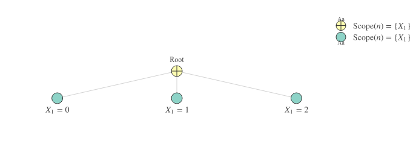
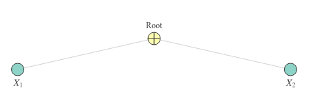
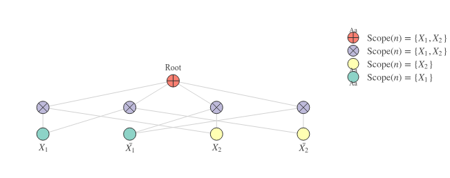
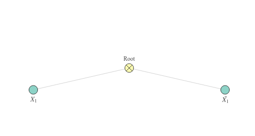
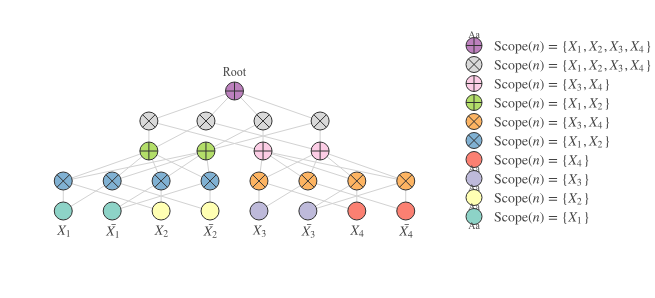

Sum-Product Networks (SPNs) are probabilistic graphical models (PGMs) that have been around for several years, with arguably a limited amount of attention from the machine learning community. I believe this is due to several things. First, the daunting success of advanced deep neural networks like convolutional neural networks and recurrent neural networks overruled much of the alternative methods that may seem inferior at first sight. Second, SPNs are nontrivial to implement in a tensorized fashion (especially when compared to CNNs or RNNs). Third, SPNs come with a rich terminology and a strict probabilistic interpretation that might seem less intuitive than 'cells that fire together wire together'. This series of posts aims at addressing these issues to varying extent by going through some basic intuitions behind SPNs, showing how to implement SPNs in a tensorized fashion and finally, looking at a hands-on example of SPNs for generative and discriminative learning on image datasets.

Quite some time ago, I joined a project where we worked on a library with 'tensorized' implementations of SPNs, known as [libspn](https://www.libspn.org/). The library leverages the flexibility and power of TensorFlow to bring SPNs to the broader ML audience. Although by now it is something I need to pursue in my spare time, I like working on it since it sets some unique engineering challenges. I'll visit these obstacles over the next few posts. I hope you feel inspired to try out these models and incorporate them in yet unexplored contexts to further unlock their potential!

This series of posts assumes basic knowledge of set theory, probability theory, neural networks and 'tensor-based' programming and computing. 

## What Can SPNs Be Used For?
SPNs can be used for tasks such as image completion ([Poon and Domingos, 2011](https://arxiv.org/abs/1202.3732)), semantic mapping for robotics ([Zheng et al., 2018](https://www.aaai.org/ocs/index.php/AAAI/AAAI18/paper/viewPaper/16923)), classification ([Gens and Domingos, 2012](https://papers.nips.cc/paper/4516-discriminative-learning-of-sum-product-networks.pdf)) and more. They be trained to tackle either unsupervised or supervised or semi-supervised problems. Depending on the task and whether we want the SPN to optimize for generative or discriminative abilities, we can train the SPN with expectation maximization (EM), gradient descent (GD) and more algorithms. In some cases, SPNs are trained for generative and discriminative abilities simultaneously ([Peharz et al, 2018](https://arxiv.org/abs/1806.01910)). 

Being fully probabilistic models, they naturally deal with incomplete data. SPNs are PGMs designed with efficiency in mind. They can perform exact joint, conditional or marginal inferences very efficiently. 

Apart from learning weights, SPNs must be carefully designed to have an adequate structure. In fact, much of the literature around SPNs is devoted to learning structures. In many cases, learning structures happens simultaneously (or in some alternating fashion) with learning weights. Therefore, having efficient tensor-based implementations of SPNs will not only push weight learning forward, but would also allow you to experiment with different structures faster.

This post introduces the first bits of what is there to know about SPNs. Although the community around it is currently relatively small, there are many ideas explored already. Have a look at this [awesome SPN repo](https://github.com/arranger1044/awesome-spn) to see what's out there.

## Sum-Product Networks And Neural Networks
Since SPNs are probabilistic graphical models (PGMs), they resemble a _probability distribution_ (either continuous or discrete). Implementation-wise, this means that our computational graph takes in random variables on one side and spits out probabilities on another side. Note that this is qualitatively different from neural networks. For neural networks, the output might be framed probabilistically, such as the softmax output for classification:
$$
p(y_i \mid \boldsymbol X) = \frac{\exp(\boldsymbol w_i^T \boldsymbol h)}{\sum_k \exp(\boldsymbol w_k ^T \boldsymbol h)}
$$
<figcaption>Equation 1: Softmax output of a neural network.</figcaption>

Nevertheless, the inputs (often image pixels) are just raw numbers fed to the network, without any explicit probabilistic interpretation. Also, all intermediate layers in a neural network lack a direct probabilistic interpretation.

Since SPNs are recursive tree-like structures, non-root nodes are roots of sub-SPNs with a probabilistic interpretation similar to the full SPN. In fact, often SPNs are thought of as _hierarchical probabilistic models_. In other words, each node in an SPN computes a probability, so the interpretation of nodes in SPNs differs significantly from hidden neurons in an MLP!

### A Shift In Terminology

More specifically, SPNs differ from neural networks in the following ways: 

- _Inputs_ are called _leaves_;
- _Neurons_ are called _nodes_;
- Each leaf node belongs to a single random variable. There can be multiple leaf nodes per random variable. For continuous variables, the leaves that correspond to a variable are the variable's _components_. For discrete categorical variables, the leaves that belong to a variable are the variable's _indicators_ (i.e. $[X_1=0, X_1=1, \ldots]$).
- A set of variables is called a _scope_. Leaf nodes have scopes of exactly one variable e.g. $\{\boldsymbol X_1\}$ or $\{\boldsymbol X_2\}$. For a non-leaf node, the scope of the node corresponds to the union of the scopes of its children. If a parent node has two children with scopes $\{\boldsymbol X_i\}$ and $\{\boldsymbol X_j\}$, then that parent has the scope $\{\boldsymbol X_i, \boldsymbol X_j\}$
- The node at the top of the tree-structure is called the _root_. The value of the root in a single upward pass of the SPN (usually) holds the _joint probability_ of all variables at the leaves of the SPN. 

In other words, SPNs are directed acyclic graphs with a tree-like structure.
The leaves of an SPN are _indicators_ (or _components_) of random variables. Additionally, each operation in an SPN must preserve the ability to interpret the computed values as probabilities. This means that the value of every node in the forward pass computes a probability. As a result, a high degree of interpretability comes for free with SPNs!

## Guaranteeing A Probabilistic Interpretation
So exactly how do we make sure that any node at any layer in an SPN computes an exact probability? In the original SPN paper ([Poon and Domingos, 2011](https://arxiv.org/abs/1202.3732)), this is more formally defined as preserving the property of _validity_ throughout the SPN. Valid SPNs efficiently and accurately model a joint probability. For a  thorough treatment of validity, I suggest you read ([Poon and Domingos, 2011](https://arxiv.org/abs/1202.3732)) and have a look at Poupart's excellent lectures ([first](https://www.youtube.com/watch?v=eF0APeEIJNw) and [second](https://www.youtube.com/watch?v=9-1YE_N-lnw)) on SPNs. 

For the purpose of these blog posts, we mostly care about _how_ we create valid SPNs. Valid SPNs can be created by

1. Restricting ourselves to (i) non-negative weighted sums and (ii) products for propagating probabilities upward;
2. Ensuring that the _scopes_ of the children of a sum node are _identical_;
3. Ensuring that the _scopes_ of the children of a product node are _pairwise disjoint_;

Let's look at the restriction of non-negative weighted sums and products first. It basically tells that we can simply use either products or weighted sums. Non-negative weighted sums occur in many probabilistic (graphical) models. Sometimes, non-negative weights correspond to _prior probabilities_. Note that to interpret the weights as probabilities we not only require them to be non-negative but we also must also ensure that they sum up to exactly one, i.e. $\sum_i w_{ij} = 1$. Let's look at an example.

### A Mixture Of Gaussians As An SPN
A common scenario is to have a mixture of Gaussians to model a single random variable:
$$
p(x) = \sum_k \underbrace{p(x \mid z=k)}_{\text{Component: } \mathcal N(\mu, \sigma^2)} \underbrace{p(z=k)}_{\text{Prior (a scalar)}}
$$
<figcaption>Equation 2: Gaussian mixture.</figcaption>

Sum nodes in SPNs compute probabilities in the same way, but the 'components' can be either (i) leaf nodes or (ii) sub-SPNs. The equation above is equivalent to the extremely simple SPN below (when replacing $z$ with $X_1$):

Note that in the SPN above, we compute a sum over elements that consider the same singular set of variables, namely $\{\boldsymbol X_1\}$. The leaf nodes correspond to the Gaussian components while the edges correspond to the non-negative weights. The value of the root corresponds to $p(x)$ in Equation 2.

In SPN terminology, a set of variables is called a scope. Leaf nodes have scopes of exactly one variable e.g. $\{\boldsymbol X_1\}$ or $\{\boldsymbol X_2\}$. Note that the SPN in Figure 1 satisfies at least requirements 1 and 2 for a valid SPN, provided we have non-negative weights. The second requirement of having identical scopes for the sum's children is also known as the _completeness_ property. The SPN in Figure 1 does not include products, so we don't really care about the third requirement. Hence, all boxes are ticked and this SPN is valid!

An SPN that violates _completeness_ is the one below. The sum that's used here has children with differing scopes, which makes it incomplete!

### Computing Joint Probabilities
What about the third requirement? Well, if we have an SPN defined over more than one variable, we should _join scopes_ to eventually obtain a root node that computes the _joint probability_ over all variables. Remember that scopes are joined by a parent node that obtains the _union_ of the scopes of its children. The third requirement describes under which conditions we are allowed to join scopes. It is also known as the _decomposability_ property. 

It might not be the first time you've heard that when computing the joint probability over two independent variables, you can simply _multiply_ the individual probabilities, e.g. 
$$
p(x,y) = p(x)p(y)
$$
<figcaption>Equation 3: The 'product' rule for computing the joint probability of two independent variables.</figcaption>

Sum-product networks compute joint probabilities in the same way: they multiply several probabilities to obtain a new joint probability.

Consider the following SPN:

Note the way in which the leaf nodes are connected to the blue product nodes. The connections are such that the scopes of the children of each node are _pairwise disjoint_. For now, let's assume we are dealing with _binary discrete variables_ (Bernoulli). I will use non-bold font $X_i$ and $\bar{X}_i$ to refer to the indicators of the random variable $\boldsymbol X_i$.

The SPN above computes the following _network polynomial_:
$$
\Phi(X_1, \bar{X_1}, X_2, \bar{X_2}) = w_1 X_1 X_2 + w_2 X_1 \bar{X_2} + w_3 \bar{X_1} X_2 + w_4 \bar{X_1} \bar{X_2} 
$$
<figcaption>Equation 4: The network polynomial of the SPN in Figure 3.</figcaption>

What in the world is a network polynomial? This is the definition from the paper by ([Poon and Domingos, 2011](https://arxiv.org/abs/1202.3732)):
>  Let $\Phi(x) \geq 0$ be an unnormalized probability distribution. The network polynomial
> of $\Phi(x)$ is $\sum_x \Phi(x) \Pi(x)$, where $\Pi(x)$ is the product of the indicators that have value 1 in state $x$.

Take a moment to see how the definition fits the network polynomial of the SPN in Figure 3. This polynomial is a so-called _multilinear_ function of the indicators $X_1$, $\bar{X_1}$, $X_2$ and $\bar{X_2}$. More info on multilinear functions can be found [here](https://en.wikipedia.org/wiki/Multilinear_map).

### Normalizing the SPN
A network polynomial uses an _unnormalized_ probability distribution, meaning that there is some constant $Z$ such that $\sum_x \Phi(x) / Z = 1$. When an SPN is _normalized_ by normalizing each sum's weight such that $\sum_i w_{ij} = 1$, the normalized SPN's network polynomial _compute probabilities directly_. In
other words:
$$
\sum_x [\Phi](x) = 1 \Rightarrow [\Phi](x) = p(x)
$$
<figcaption>Equation 5: The network polynomial of a normalized SPN computes a (marginal) probability directly.</figcaption>

Where $[\Phi]$ is the network polynomial obtained from $\Phi$ after normalizing the weights for each sum in the SPN.

**From here on, assume that our SPNs are normalized, so that the SPN computes a _'normalized'_ probability distribution.** Otherwise, all of our inferences would require about twice as many computations. If you want to understand why, it's best to consult ([Poon and Domingos, 2011](https://arxiv.org/abs/1202.3732)).

Clearly, the SPN in Figure 3 is a bit more sophisticated than the one in Figure 1. First of all, it is multi-layered. The first layer on top of the leaves consists of products of which the children have pairwise disjoint scopes (requirement 3, i.e. decomposability). The scopes of the 4 products are identical (namely $\{\boldsymbol X_1, \boldsymbol X_2\}$). Consequently, we can 'mix' those probabilities with a weighted sum node at the top of the SPN (the root). To compute the probability of a particular assignment of indicators, we replace the indicators that are included with one and those that are excluded with zeros:

$$
p(\{X_1, X_2\}) = w_1 \cdot 1 \cdot 1 + w_2 \cdot 0 \cdot 1 + w_3 \cdot 0 \cdot 1 + w_4 \cdot 0 \cdot 0 = w_1
$$
<figcaption>Equation 6: Evaluation of the network polynomial when we know that both variables are 'true'.</figcaption>

Or, alternatively:

$$
p(\{\bar{X_1}, X_2\}) = w_1 \cdot 0 \cdot 1 + w_2 \cdot 0 \cdot 0 + w_3 \cdot 1 \cdot 1 + w_4 \cdot 1 \cdot 0 = w_3
$$
<figcaption>Equation 7: Evaluation the of network polynomial when we know that the first variable is 'false' and the second is 'true'.</figcaption>

If one of the two variables is unknown, we can easily _marginalize out_ this variable by setting both its indicators to 1. If $\boldsymbol X_2$ is unknown, we can
compute the probability of observing $X_1$ at all as follows:

$$
p(\{X_1,X_2,\bar{X_2}\}) = w_1 \cdot 1\cdot 1 + w_2 \cdot 1 \cdot 1 + w_3 \cdot 0 \cdot 1 + w_4 \cdot 0 \cdot 1 = w_1 + w_2
$$
<figcaption>Equation 8: Evaluation of the network polynomial when we know that the first variable is 'true' and we have no evidence to support either 'true' or 'false' for the second variable, so it's marginalized out by setting both indicators to one.</figcaption>

### A Non-Decomposable SPN
Below is an example of a simple SPN that is not decomposable. The root has two children with the same scope, whereas we are not allowed to have any overlap in their scopes. Even though the indicators are different, they belong to the same variable $\boldsymbol X_1$.

 

## Stacking More Layers
The scopes of a product's children can contain more than a single random variable. Take, for instance, the following SPN:
 

Figure 5 displays an SPN with even more layers than the one in Figure 3. The first product layer combines either $\{\boldsymbol X_1\}$ and $\{\boldsymbol X_2\}$ into $\{\boldsymbol X_1, \boldsymbol X_2\}$ (the blue products) or $\{\boldsymbol X_3\}$ and $\{\boldsymbol X_4\}$ into $\{\boldsymbol X_3, \boldsymbol X_4\}$ (the orange products). The blue product nodes are followed up by the green sum nodes and the orange product nodes by the pink sum nodes (they do not alter the scope, but merely 'mix' the probabilities of the underlying scopes). These green and pink nodes have scopes with two variables each. Moreover, if we take one green node and one pink node, then that results in pairwise disjoint sets, so we can safely join those scopes by a product node (the grey nodes at the penultimate layer). Finally, all the grey nodes at the penultimate layer have identical scopes, so we can 'mix' those probabilities in the final root sum.

Check out the overview of the scopes on the right of Figure 3 and verify yourself that the SPN is indeed (i) decomposable by checking the products' children's scopes for having no overlap in their scopes (pairwise disjoint) and (ii) complete by checking the sums' children's scopes for being identical. In case these two properties check out, that means the SPN is valid!

Note that the architecture in the SPNs above is arbitrary (as long as the products are decomposable and the sums are complete), so we can easily increase the number of sums per layer, reduce the number of products per layer etc. However, for the purpose of illustration, I've kept things relatively small.

#### More Advanced Architectures
Despite the constraints on the exact architecture of these networks, SPNs can also be framed as convolutional architectures to cope with image-like data ([van de Wolfshaar and Pronobis, 2019](https://arxiv.org/abs/1902.06155)) or dynamic architectures to cope with sequence data ([Melibari et al., 2016](http://proceedings.mlr.press/v52/melibari16.html)). This is, however, outside the scope of this post. Stay tuned though... 

## Wrapping Up
If you're coming from a background with a main focus on neural networks or other common machine learning approaches, the amount of theory and terminology coming at you in this post might seem a bit overwhelming at first. I'll try and show in the next few posts that it's nevertheless feasible to create implementations of SPNs that feel similar to the _Keras_ style of stacking layers in an object-oriented fashion, even though we have to take care of constraints like decomposability and completeness. 

At least remember the following things:

1. SPNs are probabilistic models that can be used for doing inferences (very efficiently) like 
    * Marginalizing out variables: useful for when part of your input is missing.
    * Conditional inference: useful for classification. We'll get to this in a later blog post.
2. SPNs can be seen as feed-forward architectures with a few constraints:
    * Decomposability: a product should not have children with overlapping scopes (think about the product rule of multiplying independent probabilities to get a joint distribution).
    * Completeness: a sum's children must have identical scopes.
3. Normalize your SPNs so that they compute a normalized probability distribution, rather than an unnormalized probability distribution.
4. An SPN's nonlinearities are its products. SPNs can be seen as a special kind of neural networks.

## What's Next
Hope you're still with me because there's more to come! At this point, we have only touched on the basic terminology and some simple architectures. In the next post, we'll be looking into the actual implementation of SPNs in a tensorized fashion, after which it becomes easy to experiment with them.

## References
* Poon, Hoifung, and Pedro Domingos. "Sum-product networks: A new deep architecture." 2011 IEEE International Conference on Computer Vision Workshops (ICCV Workshops). IEEE, 2011.
* Zheng, Kaiyu, Andrzej Pronobis, and Rajesh PN Rao. "Learning graph-structured sum-product networks for probabilistic semantic maps." Thirty-Second AAAI Conference on Artificial Intelligence. 2018.
* Gens, Robert, and Pedro Domingos. "Discriminative learning of sum-product networks." Advances in Neural Information Processing Systems. 2012.
* Peharz, Robert, et al. "Probabilistic deep learning using random sum-product networks." arXiv preprint arXiv:1806.01910 (2018).
* Van de Wolfshaar, Jos, and Andrzej Pronobis. "Deep Convolutional Sum-Product Networks for Probabilistic Image Representations." arXiv preprint arXiv:1902.06155 (2019).
* Melibari, Mazen, et al. "Dynamic sum product networks for tractable inference on sequence data." Conference on Probabilistic Graphical Models. 2016.