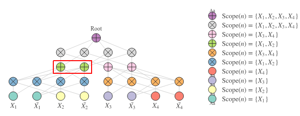
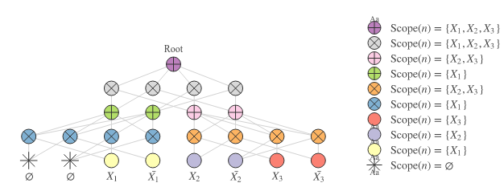
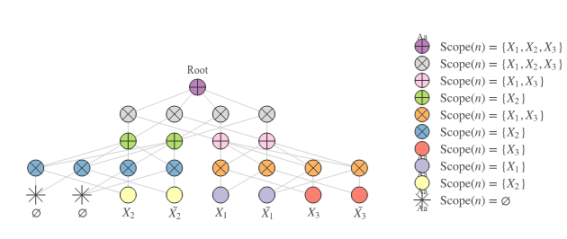

In this post, we get to the second stop on the road to tensor-based implementations of Sum-Product Networks. The code snippets here are also part of the implementation of [LibSPN](https://github.com/pronobis/libspn), although the library accomplishes all of it in a more generic way. 

In [Part I](../spn01), we have looked at the fundamental principles for Sum-Product Networks. Recall the following:
* SPNs consist of leaf nodes, sum nodes and product nodes.
* Leaf nodes correspond to _indicators_ (discrete) or _components_ (continuous) of single variables.
* A _scope_ is a set of variables. 
* A parent node obtains the _union_ of the scopes of its children. 
* Leaf nodes have scopes of exactly one variable. 
* The scope of the root node contains all variables.
* Children of sum nodes must have identical scopes to ensure _completeness_.
* Children of product nodes must have pairwise disjoint scopes to ensure _decomposability_.
* Decomposability and completeness are sufficient properties for _validity_.
* A _valid_ SPN computes an unnormalized probability. 
* A _normalized_ valid SPN computes a normalized probability directly.

So let's see how we can implement the most important parts of an SPN's forward propagation in TensorFlow. 

## Layered Implementations
Thinking of neural architectures or SPN structures in terms of layers helps us to quickly summarize the layout of a model. By simply giving the description of these layers, we can get a grasp of the complexity of the model and how it tends to divide and conquer its inputs. In the realm of neural networks, layers serve as the de facto implementation strategy. In fact, most feedforward layers can be expressed with only a few operations. 

Take, for instance, a dense layer with ReLU activations:
$$
Y = \max\{XW, 0\}
$$
Where $X$ is a matrix with dimensions `[batch, num_in]` and $W$ is a weight matrix with dimensions `[num_in, num_out]`. In TensorFlow, this is simply:
```python
Y = tf.nn.relu(tf.matmul(X, W))
```
Such that the output `Y` is a matrix of shape `[batch, num_out]`.

Other layer types like convolutional layers or recurrent layers will require slightly different views on the dimensions and internal operations. Nevertheless, they usually have a leading `batch` dimension the input tensors including some sort of _dot product_ operations with weight vectors to compute activations of neurons.

We will aim to bring our SPN implementation close to this approach: if we manage to describe SPN layers in terms of a few operations to compute all sum or product operations for all nodes in a single layer (and for all samples in the batch), then we maximally exploit TensorFlow's ability to launch these operations in parallel on GPUs! As opposed to MLPs, such an implementation presents some nontrivial challenges specific to SPNs which we'll get to next. 

In the remainder of this post we look at a generic tensor-based implementation of the most important components in SPNs:
1. A sum layer that computes all sums at a particular depth of the SPN;
2. A product layer that computes all products at a particular depth of the SPN.

### Sum Layer
A sum layer in an SPN computes weighted sums, similar to a dense layer in an MLP. There are two noticable differences with weighted sums in dense layers and weighted sums in SPN layers:
1. SPN layers compute _probabilities_ and should be implemented to operate in the log-domain to avoid _numerical underflow_;
2. A single sum in a sum layer of an SPN is connected to only a _subset_ of the preceding layer, as it can only have children with identical scopes.

#### Matrix Multiplications In The Log Domain
The first issue mentioned above makes it seem impossible to use matrix multiplications or similar dot-product based operations to compute our sum layer's outputs as such operations (e.g. `tf.matmul` or `tf.tensordot` operate in linear space). 

That's utterly sad news! GPUs simply shine at doing matrix multiplications. Are we doomed already? Let's try to find out.

Let's take a step back and assume that we only want to compute the log-probability of a **single** sum node. A minimal implementation in TensorFlow would at least contain:
```python
# x is a vector of log-prob inputs, while w is a vector of weights 
out = tf.reduce_logsumexp(x_prime + w_prime)
```
As we're operating in the log-domain, the pairwise multiplication of $\boldsymbol x$ and $\boldsymbol w$ becomes a pairwise _addition_ of the log-space correspondents $\boldsymbol x'$ and $\boldsymbol w'$. 

To sum up the pairwise multiplications **in log-space**, we use `tf.reduce_logsumexp`. This built-in TensorFlow function computes the following:
$$
y' = \log \left( \sum_i \exp(x_i' + w_i') \right)
$$
But here lies a danger: computing $\exp(x_i' + w_i')$ could already result in underflow. The remedy is to subtract a constant $c$ from each element of the result of $x_i'$ and $w_i'$:
$$
y' = c + \log \left( \sum_i \exp(x_i' + w_i' - c) \right)
$$
Usually, $c$ is set to $\max(x_1' + w_1', x_2'+w_2', \ldots, x_N'+w_N')$. In fact, this is already part of the implementation of `tf.reduce_logsumexp`. 

#### Extracting The Dot Product
But wait, this doesn't look anything like a dot product! Let's do something about this.

If you look closely, the equation of `tf.reduce_logsumexp` above just changes from the log domain to the linear domain before doing the summation and finally goes back to the log domain. If we forget about numerical stability for a bit, we could also read it as follows:
$$
y' = \log \left( \sum_i \exp(x_i') \cdot \exp(w_i') \right)
$$
The inner part $\sum_i \exp(x_i') \cdot \exp(w_i')$ is just a dot product of two exponentialized vectors (i.e. they are transformed from the log-domain to the linear domain). But if this is a dot product, could we use matrix multiplications for sum layers after all?

A naively applied dot product (or matrix multiplication) wouldn't take care of numerical stability, so that would be a dead end... 

#### Dot Products Without Underflow

The constant $c$ above was subtracted to avoid underflow, so at least the higher values of the pairwise addition _would not become zero_ after applying $\exp$. But do we have to sum up $x'_i$ and $w'_i$ before subtracting $c$? Why not subtract a constant $c$ from $\boldsymbol x'$ and another constant $d$ from $\boldsymbol w'$ directly?

$$
y' = c + d + \log \left( \sum_i \exp(x_i' - c) \cdot \exp(w_i' - d) \right)
$$

By doing so, we obtain a dot product while preserving numerical stability. Splendid!

Since matrix multiplications are just multiple dot products (where vectors are potentially reused in several dot products in the resulting matrix), we can generalize the trick above as follows:
$$
Y' = C + D + \log\bigg( \exp\big(X'-C\big) \exp\big(W'-D\big) \bigg)
$$

[LibSPN](https://github.com/pronobis/libspn) implements a `logmatmul` function that uses this idea which is displayed here:
```python{17-23}
def logmatmul(a, b, transpose_a=False, transpose_b=False, name=None):
    with tf.name_scope(name, "logmatmul", [a, b]):
        # Number of outer dimensions
        num_outer_a = len(a.shape) - 2
        num_outer_b = len(b.shape) - 2

        # Reduction axis
        reduce_axis_a = num_outer_a if transpose_a else num_outer_a + 1
        reduce_axis_b = num_outer_b + 1 if transpose_b else num_outer_b

        # Compute max for each tensor for numerical stability
        max_a = replace_infs_with_zeros(
            tf.stop_gradient(tf.reduce_max(a, axis=reduce_axis_a, keepdims=True)))
        max_b = replace_infs_with_zeros(
            tf.stop_gradient(tf.reduce_max(b, axis=reduce_axis_b, keepdims=True)))

        # Subtract
        a -= max_a
        b -= max_b

        # Compute logsumexp using matrix mutiplication
        out = tf.log(tf.matmul(
            tf.exp(a), tf.exp(b), transpose_a=transpose_a, transpose_b=transpose_b))

        # If necessary, transpose max_a or max_b
        if transpose_a:
            max_a = tf.transpose(
                max_a, list(range(num_outer_a)) + [num_outer_a + 1, num_outer_a])
        if transpose_b:
            max_b = tf.transpose(
                max_b, list(range(num_outer_b)) + [num_outer_b + 1, num_outer_b])
        out += max_a
        out += max_b
    return out
```
The highlighted block in the code above implements the matrix multiplication in the log domain using TensorFlow operations. The remaining code is either to determine the constants `max_a` and `max_b` or to know which dimensions to use in case we have a so-called _batched_ matrix multiplication with tensors of dimensions higher than 2.

The matrix $X'$ corresponds to the log probabilities of the inputs of a set of sum nodes with the same scope. Each row in the matrix contains these inputs for a single sample in the batch. In other words, we could think of it as `[batch, num_in_per_scope]` dimensions. 

The matrix $W'$ corresponds to the log weights of multiple sum nodes which are all connected to the same set of children with identical scopes. It's dimensions are `[num_in_per_scope, num_out_per_scope]`.

With the matrix multiplication in log-space we would be able to compute the sums activation in the highlighted part of the SPN in Figure 1:



That's good progress! This trick at least works for any number of inputs with the same scopes and any number of outputs. However, we are only computing a small part of the sum layer at the moment, so we'll need to do better.

#### Computing Sums For Multiple Scopes And Decompositions
Note that there's a slight difference in the way we referred to the dimensions in the last paragraph as compared to MLPs. In the case of SPNs, we also care about _scopes_ being identical for sum children. However, we want to do better than computing probabilities for a single scope only.

We can compute the weighted sums for multiple scopes simultaneously by just introducing another dimension for the scopes.  In this case: 
* The input tensor would have shape `[num_scopes, batch, num_in_per_scope]` 
* Our weight tensor would take shape `[num_scopes, num_in_per_scope, num_out_per_scope]`. 

By doing so, we can still use `logmatmul`, as it 'batches' the outer-most dimension (the one with `num_scopes`):

```python
# The shape of X_prime is [num_scopes, batch, num_in_per_scope]
# The shape of W_prime is [num_scopes, num_in_per_scope, num_out_per_scope]
# The shape of Y_prime is [num_scopes, batch, num_out_per_scope]

# The resulting tensor contains the log matrix multiplication for all scopes and
# for all sums per scope 
Y_prime = logmatmul(X_prime, W_prime)   
```

Our implementation of `logmatmul` exploits the fact that `tf.matmul` is able to compute several matrix multiplications in parallel. In this case, they are parallelized over scopes. The docstrings of the matmul operation also list this example to clarify:
```python
# 3-D tensor `a`
# [[[ 1,  2,  3],
#   [ 4,  5,  6]],
#  [[ 7,  8,  9],
#   [10, 11, 12]]]
a = tf.constant(np.arange(1, 13, dtype=np.int32),
                shape=[2, 2, 3])

# 3-D tensor `b`
# [[[13, 14],
#   [15, 16],
#   [17, 18]],
#  [[19, 20],
#   [21, 22],
#   [23, 24]]]
b = tf.constant(np.arange(13, 25, dtype=np.int32),
                shape=[2, 3, 2])

# `a` * `b`
# [[[ 94, 100],
#   [229, 244]],
#  [[508, 532],
#   [697, 730]]]
c = tf.matmul(a, b)
```
Note that the output tensor `c` is of shape `[2, 2, 2]`, so there are 2 matrix multiplications performed in parallel. In the case of our tensorized SPNs, this would correspond to all sums in a layer for 2 different scopes.

#### Limitations Of This Approach
Although framing our forward pass this way is concise and efficient, it also enforces us to have dimension sizes that are the same for any scope. In other words, each scope will have the same number of inputs and the same number of outputs, unless we explicitly mask these. 

Nevertheless, the proposed approach maximally exploits CUDA's matrix multiplication GPU kernels. So even if we'd use use separate matrix multplications for scopes with different dimensions instead of masking, the all-in-one Op approach is presumably still faster.

### Product Layer
SPNs combine scopes by multiplying nodes. In other words, they compute joint probabilities by (hierarchically) multiplying probabilities of subsets of variables. Let's say we have a sum layer for 2 scopes with 4 output nodes per scope. If we were to apply a product layer on top of this to join the two scopes, we can generate $4^2$ permutations of nodes. In general, if a product joins $m$ scopes of size $n$ each, there are $n^m$ possible permutations.

Let $\boldsymbol u$ be the vector of probabilities of the first scope and $\boldsymbol v$ be the vector of probabilities of the second scope. In that case, we can compute an outer product to find a matrix containing all possible permutations:

$$
Y_{n,n} = \boldsymbol u \boldsymbol v^\top = 
 \begin{pmatrix}
  u_1 v_1 & u_1 v_2 & \cdots & u_1 v_n \\
  u_2 v_1 & u_2 v_2 & \cdots & u_2 v_n \\
  \vdots  & \vdots  & \ddots & \vdots  \\
  u_n v_1 & u_n v_2 & \cdots & u_n v_n 
 \end{pmatrix}
$$

Rather than limiting ourselves to joining one pair of scopes and one sample, let's try to do this for multiple pairs of scopes and any number of samples. 

Suppose we have a tensor `x` of shape `[num_scopes, batch, num_in]`. We want to join pairs of adjacent pairs of scopes within this tensor by products. In linear space, we can achieve this as follows:
```python
# The batch dimension is dynamic. Also assume we already have 
# int values for num_scopes and num_in
x_reshaped = tf.reshape(x, [num_scopes // 2, 2, -1, num_in])

# Split up this tensor to get two scopes with 'adjacent' scopes
u, v = tf.split(x, axis=1)

# Compute the outer product to join the scopes. Y will have 
# shape [num_scopes // 2, batch, num_in, num_in]
Y = tf.reshape(u, [num_scopes // 2, -1, num_in, 1]) * \ 
    tf.reshape(v, [num_scopes // 2, -1, 1, num_in])

# Flatten the matrix of permutations in a single axis
num_out = num_in * num_in
Y = tf.reshape(Y, [num_scopes // 2, -1, num_out])
```

TensorFlow will conveniently broadcast the values so that the outer product is computed for all scopes and all samples in the batch in one go. Broadcasting works with the addition operator too, so we can easily switch to log-space computation by just using `+` (rather than `*`). 

#### Dummy Variables
With this approach we're assuming that the number of scopes is _divisible by 2_. In general, if we stack product layers $\ell_1,\ell_2,\ldots,\ell_N$, we need to have $\prod_i \phi_i$ scopes at the leaf layer where $\phi_i$ is the number of scopes being joined at product layer $\ell_i$. 

For example, if we want to stack 3 product layers (with sum layers in between) that join e.g. 2, 4 and 2 scopes respectively we have $2\cdot 4 \cdot 2=16$ scopes at the bottom-most layer. But if our data only has 15 different variables, then such a division of scopes doesn't make sense. 

There is a neat workaround for this. We can employ 'dummy variables' that are always marginalized out, such that they don't affect computed inferences at all. We achieve this by setting the dummy variables' values to a fixed probability of 1, which just corresponds to zero-padding in log-space (since $\log 1 = 0$).

The SPN below shows an example of dummy variables:


 


#### Limitations And Extensions
There is no reason to limit ourselves to just using products that join 2 scopes. We might as well perform outer products on the last $m$ dimensions if we want to join $m$ scopes. In that case, we would have to change the implementation of the product layer a little bit, but the general idea is the same.

One limitation of this approach still as that we again enforce the same number of outputs for all scopes in the SPN. So again, unless we mask inputs or outputs of these products somehow, our structure is forced to be homogeneous.

## Adding Decompositions
In many cases, SPNs consist of several so-called _decompositions_. A decomposition describes how scopes are joined hierarchically from the leaf nodes all the way up to the root. The penultimate layer of the SPN in Figure 1 (with the grey product nodes under the root) decomposes $\{X_1,X_2,X_3\}$ into $\{X_1\}$ on the left side and $\{X_2,X_3\}$ on the right side. The bottom-most product layer decomposes $\{X_1\}$ into $\emptyset$ and $\{X_1\}$ at the blue product nodes and $\{X_2,X_3\}$ into $\{X_2\}$ and $\{X_3\}$ at the orange product nodes. We can summarize such a decomposition as: 

$$
\bigg\{\Big\{\emptyset,\{X_1\}\Big\},\Big\{\{X_2,\},\{X_3\}\Big\}\bigg\}
$$

But this decomposition is just one possibility. We can also have a decomposition such as the one in Figure 2:

 

Which corresponds to:
$$
\bigg\{\Big\{\emptyset,\{X_2\}\Big\},\Big\{\{X_0,\},\{X_1\}\Big\}\bigg\}
$$

#### Multiple Decompositions
In practice, SPNs often have more than 1 decomposition, so that different variable interactions and hierarchies can be modeled in different sub-SPNs. In the case of classification, each class often has its own sub-SPN with a root that contains all variables on top of the leaf nodes. Each of these class-specific roots can be joined by a _root sum node_, as they all have identical scopes.

In fact, the implementation of sum layers and product layers layers in [LibSPN](https://github.com/pronobis/libspn) use **another leading dimension** for decompositions. The layers compute the sums or products for (i) all scopes (ii) all decompositions (iii) all samples in one go. 

The internal tensors are represented as rank 4 tensors with dimensions `[num_scopes, num_decompositions, batch, num_nodes_per_block]`. Each 'block' corresponds to a particular scope + decomposition.

The following snippet constructs an SPN with a sum root and 2 sub-SPNs. The first sub-SPN corresponds to Figure 1 and the second to Figure 2 (note the `fixed_permutations` parameter).

```python
import libspn as spn

# Layer with leaf indicators
indicators = spn.IndicatorLeaf(num_vars=3, num_vals=2)

# Layer that generates decompositions
x = spn.BlockGenerateDecompositions(
    indicators, num_decomps=2, 
    fixed_permutations=[[0, 1, 2], [1, 0, 2]]
)

# Permute nodes of two different scopes
x = spn.BlockPermuteProduct(x, num_factors=2)

# Two sums on top of each scope / decomposition
x = spn.BlockSum(x, num_sums_per_block=2)

# Permute nodes of two different scopes
x = spn.BlockPermuteProduct(x, num_factors=2)

# Merge the 2 decompositions into 1
x = spn.BlockMergeDecomps(x, num_decomps=1)

# Construct a root node
root = spn.BlockRootSum(x)
```

There you have it, tensor-based implementations of an SPN's forward pass! There is still work to do to train such SPNs, but at least we got the most important elements in place now. 

In the next post of this series, we'll cover training of SPNs for generative or discriminative problems, so stay tuned!